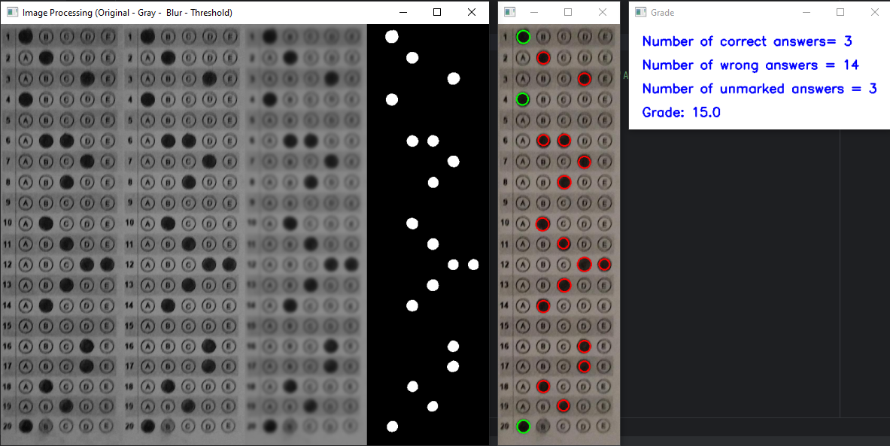

# Optical Mark Recognition

In this project, the data marked on optical papers are processed in a short time using computer vision. This software aims to read data from optical paper more accurately. 

## Python modules
- OpenCV
- NumPy
- scikit-image

## Example Output
